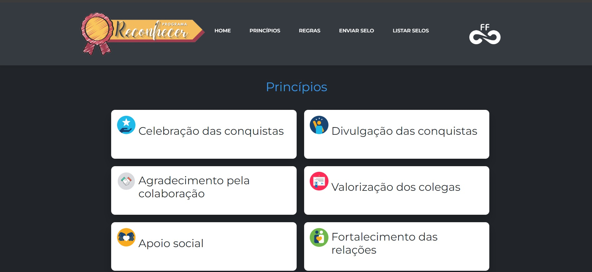

# RECONHECER

Programa de reconhecimento

* Este projeto foi desenvolvido em php, html, js, css e mysql. Objetivo celebrar pequenas e grandes conquistas, bem como o senso de cooperação dos colaboradores..
* O sistema possui login, para extrair os selos já encaminhados. Necessário login;
* O banco de dados encontra-se na pasta mysql, com dados para teste;

## Arquivo selo.csv

* Este arquivo é onde será salvo os selos encaminhados.

## Login

* Para visualizar os selos já encaminhado utilize o login de teste:
    * Usuario: admin
    * Senha: admin

### Instalação linux:
- Importe o projeto
- Dê permissões ao arquivo selo.csv 
	* `sudo setenforce 0` 
	* `sudo chcon -t httpd_sys_rw_content_t /var/www/html/reconhecer/selo.csv -R` 
	* `sudo chown apache:apache selo.csv && sudo chmod 777 selo.csv`
	* `sudo setenforce 1`

### Substiruir:
- Como o arquivo CSV está separado por vírgula, adicionei um JS para substituir na Mensagem as vírgulas por ponto e vírgula.

## Imagens do Projeto

### Home

* No inicio da página conseguimos clicar nos dois selos que nos direciona para o formulário de envio

  

### Principios 

* Descrição dos princípios do programa

  

### Regras

* Descrição das regras do programa

  

### Enviar Selo

* Formulário de envio do selo

  

### Listar Selo

* Para listar os selos será necessário login utilize usuario e senha informado no inicio desse documento;

  

#### Lista

* Será carregado os dados do arquivo selo.csv;
* Temos disponível a opção para fazer download do arquivo CSV.

  